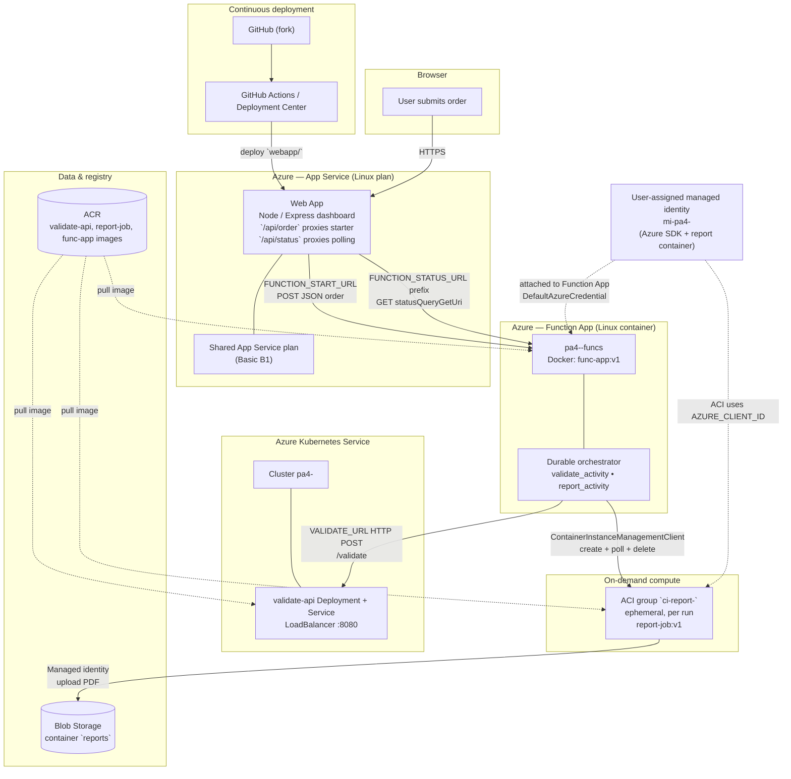

# TaskFlow PA4 — Architecture Diagram

Rendered Mermaid diagram (GitHub preview). Naming matches typical PA rollout; align labels with **your** Web App URL, Function App hostname, ACR registry name (`pa4` + digits), AKS cluster name, and MI name (`mi-pa4-<digits>`).

## Legend (rubric alignment)

| Flow | Meaning |
|------|--------|
| GitHub → App Service | CI/CD for the web frontend only; images for backend come from ACR. |
| Web → Function | HTTP starter + Durable status polling via app settings. |
| Function → AKS | Synchronous HTTP validation on every accepted workflow path. |
| Function → ACI | Imperative **per-order** container group; deleted after completion in code paths. |
| ACI → Blob | One-shot PDF write using managed identity credentials. |
| ACR dashed lines | Pull secrets (AKS secret) / registry credentials (Function + ACI). |

For Tasks 7–8, export this page to PNG from GitHub (“…” → Download / or use Mermaid CLI) **or** redraw in draw.io following the same boxes and arrows.
